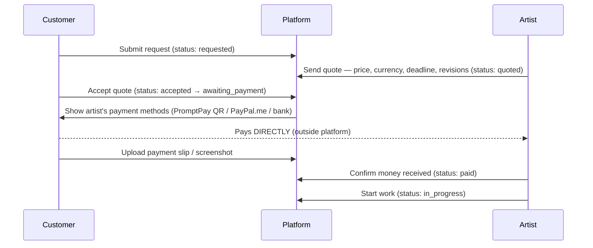

# 03 — User Flows

Step-by-step journeys for the key scenarios. Screens named here map to the routes in [06-tech-stack.md](06-tech-stack.md).

## Flow A — Artist onboarding

1. Sign up (email or Google) → choose username, display name, language.
2. Prompt: "Are you here to sell art, buy art, or both?" → choosing "sell" or "both" turns on **artist mode**.
3. Artist setup wizard (each step skippable):
   1. Upload avatar/banner, write bio, add style tags.
   2. Create at least one price-sheet offer (name, description, base price + currency, sample image).
   3. Add payment methods — PromptPay (ID or QR image), PayPal.me link, bank account, or other (free text). At least one required before commissions can be accepted.
   4. Write terms of service (template provided: revisions, refunds, usage rights, deadlines).
   5. Set commission status: Open / Closed / Waitlist.
4. Land on profile with a "share your profile" nudge and a prompt to make a first portfolio post.

## Flow B — Customer discovers and requests a commission

1. Customer browses **discover feed** or searches artists (filter: style tag, price range, status = Open, language).
2. Opens artist profile → sees portfolio gallery, price sheet, rating, terms, **Open** badge.
3. Clicks **Request commission** (or starts a chat first to ask questions — a request can be created from inside the chat later).
4. Request form: pick an offer from the price sheet (or "custom"), describe the piece, upload references, state a hoped-for deadline.
5. Submit → commission created with status `requested`; artist gets a notification; a linked conversation opens automatically.

## Flow C — Quote, acceptance, and payment

Notes:
- Either side can decline/counter at the `quoted` stage; each re-quote is a timeline event.
- Artist can require a deposit: quote specifies e.g. "50% to start, 50% before final delivery" → two payment records, and status moves to `paid` when the deposit is confirmed (final payment gate happens before delivery of full-res files).
- If the customer never pays, the artist (or an auto-nudge after N days) can cancel → `cancelled`.

## Flow D — Work, WIP review, delivery, completion

1. Artist posts WIP images to the commission timeline (status: `wip_review` when explicitly requesting feedback).
2. Customer approves ("looks great, continue") or requests a revision — the platform counts revisions against the quoted allowance; extra revisions can be re-quoted as an add-on payment record.
3. When finished (and final payment confirmed, if split), artist uploads final files → status `delivered`. Final files live in **private storage**; only the two parties can download.
4. Customer marks **complete** (or auto-completes after 14 days with no objection) → status `completed`.
5. Both parties are prompted to leave a review (hidden until both submit or 14 days pass).

## Flow E — Dispute

1. Either party opens the commission and clicks **Flag a problem** → picks a reason (no delivery, no payment, quality disagreement, harassment) + description.
2. Commission gets a `disputed` flag (status itself is frozen); both parties are notified; an admin case is created.
3. Admin reviews the **timeline** (agreements, payment slips, WIPs, deliveries are all timestamped) and mediates in a 3-way thread.
4. Outcomes in the direct-payment model: guidance to resolve, formal warning, account suspension, review annotation ("resolved in customer's favor"). The platform **cannot force refunds** — this limitation is stated clearly in the UI and ToS (and is a key motivation for phase-3 escrow, see [05-payments.md](05-payments.md)).

## Flow F — Social loop (retention)

1. Artist finishes a commission → one-click "share to feed" creates a post from the final piece (with customer permission toggle at delivery time).
2. Followers see it in home feed → likes/comments → non-followers find it via discover/tags.
3. Post carries a **Commission me** button → back to Flow B.

## Edge cases to handle from day one

- Artist deactivates or is suspended mid-commission → customer notified, commission auto-flagged for admin visibility.
- Customer ghosting at `wip_review` → auto-continue after N days (per artist ToS) or artist cancels with timeline evidence intact.
- Slip uploaded but artist disputes receiving money → dispute flow E; slips are stored with upload timestamp and uploader identity.
- Currency mismatch (customer expected THB, quote in USD) → quote acceptance screen always shows currency explicitly and requires a checkbox-style confirm.
