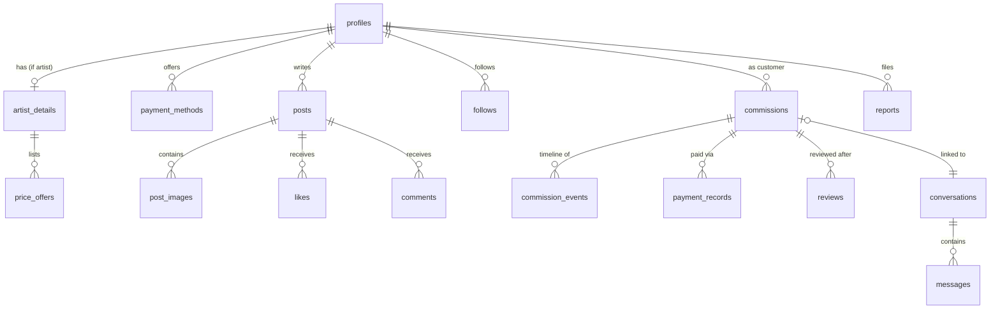

# 04 — Data Model

Postgres schema for Supabase. Conventions: all tables have `id uuid primary key default gen_random_uuid()` and `created_at timestamptz default now()` unless noted; `user_id`-style columns reference `profiles.id`; RLS (Row Level Security) is **enabled on every table**.

## Entity relationship overview

## Identity & profiles

### `profiles`
Mirrors `auth.users` (created by trigger on signup).

| column | type | notes |
|--------|------|-------|
| id | uuid PK | = `auth.users.id` |
| username | citext unique | handle, 3–30 chars |
| display_name | text | |
| avatar_url / banner_url | text | Supabase Storage paths |
| bio | text | |
| locale | text | `th` / `en` |
| links | jsonb | `[{type:"twitter", url:"…"}]` |
| is_artist | boolean default false | artist mode toggle |
| is_admin | boolean default false | set manually |
| suspended_at | timestamptz null | |

RLS: readable by everyone; updatable only by owner (`auth.uid() = id`); `is_admin`/`suspended_at` changeable only via service role.

### `artist_details`

| column | type | notes |
|--------|------|-------|
| profile_id | uuid PK → profiles | 1:1 |
| commission_status | enum `open/closed/waitlist` | |
| terms_of_service | text | markdown |
| style_tags | text[] | |
| verified_at | timestamptz null | admin-set |

RLS: readable by everyone; owner-updatable (except `verified_at`).

### `price_offers`

| column | type | notes |
|--------|------|-------|
| artist_id | uuid → profiles | |
| name / description | text | |
| base_price | numeric(10,2) | |
| currency | enum `THB/USD` | |
| sample_image_urls | text[] | |
| sort_order | int | |
| is_active | boolean | soft-hide instead of delete (commissions reference offers) |

### `payment_methods`

| column | type | notes |
|--------|------|-------|
| artist_id | uuid → profiles | |
| type | enum `promptpay/paypal/bank_transfer/other` | |
| label | text | e.g. "Kasikorn – Poom" |
| details | jsonb | per type: `{promptpay_id}` or `{qr_image_url}`, `{paypal_me_url}`, `{bank, account_no, account_name}`, `{instructions}` |
| is_active | boolean | |

RLS: **not** world-readable. Readable by the owner, and by a customer only while they share an active commission in `accepted`/`awaiting_payment`/`paid`/later states with that artist (policy via `exists` subquery on `commissions`). Prevents scraping of PromptPay IDs/bank numbers.

## Social

### `posts`
`author_id`, `body text`, `tags text[]`, `is_portfolio boolean`, `is_sensitive boolean`, `like_count int default 0` (denormalized via trigger), `comment_count int default 0`, `deleted_at timestamptz null` (soft delete).

### `post_images`
`post_id`, `storage_path`, `alt_text`, `width`, `height`, `sort_order`. Max 10 per post (checked in app + constraint trigger).

### `likes`
`post_id`, `user_id`, unique `(post_id, user_id)`. RLS: insert/delete own rows only.

### `comments`
`post_id`, `author_id`, `parent_comment_id uuid null` (single-level replies), `body`, `deleted_at`.

### `follows`
`follower_id`, `followee_id`, unique pair, check `follower_id <> followee_id`.

Feeds: home feed = posts where `author_id in (select followee_id from follows where follower_id = auth.uid())`; discover = recent + `like_count` ranking. Add a materialized/precomputed feed only if scale demands (see [06-tech-stack.md](06-tech-stack.md)).

## Chat

### `conversations`
`id`, `created_at`, `last_message_at` (trigger-updated, for inbox sorting).

### `conversation_members`
`conversation_id`, `profile_id`, `last_read_at timestamptz`, `accepted_at timestamptz null` (null = message request, v1), unique pair. MVP enforces exactly 2 members per conversation in app logic; schema already allows groups for v2.

### `messages`
`conversation_id`, `sender_id`, `body text null`, `image_url text null`, `commission_id uuid null` (system messages linking commission events into chat), check `body is not null or image_url is not null`.

RLS: all chat tables readable/writable only where `exists (select 1 from conversation_members m where m.conversation_id = X and m.profile_id = auth.uid())`. Realtime: subscribe per conversation channel; RLS applies to realtime reads too.

## Commissions

### `commissions`

| column | type | notes |
|--------|------|-------|
| customer_id | uuid → profiles | |
| artist_id | uuid → profiles | |
| conversation_id | uuid → conversations | linked chat |
| offer_id | uuid → price_offers null | null = custom |
| title / description | text | |
| reference_image_urls | text[] | |
| status | enum (below) | |
| quoted_price | numeric(10,2) null | |
| currency | enum `THB/USD` null | set at quote |
| revisions_included | int null | |
| revisions_used | int default 0 | |
| deadline | date null | |
| payment_plan | enum `full_upfront/split_50_50` default `full_upfront` | |
| disputed_at | timestamptz null | freezes transitions |
| completed_at / cancelled_at | timestamptz null | |

Status enum: `requested, quoted, accepted, awaiting_payment, paid, in_progress, wip_review, delivered, completed, cancelled, declined`.

**Transitions are enforced server-side only** (Next.js route handlers using the service role, or a `security definer` Postgres function): clients never update `status` directly. RLS: `select` for the two parties + admins; `insert` by customer (status forced to `requested`); no direct `update` of protected columns.

### `commission_events`
Append-only timeline — the audit trail.

`commission_id`, `actor_id uuid null` (null = system), `type` enum (`status_change, quote, payment_submitted, payment_confirmed, wip_posted, revision_requested, delivery, note, dispute_opened, dispute_resolved`), `payload jsonb` (e.g. quote details, image paths), `created_at`.

RLS: `select` for the two parties + admins; `insert` via server only; **no update/delete policies at all** — immutability is the point.

### `payment_records`
Designed to be **gateway-ready** from day one.

| column | type | notes |
|--------|------|-------|
| commission_id | uuid → commissions | |
| kind | enum `deposit/final/full/addon` | |
| amount | numeric(10,2) | |
| currency | enum `THB/USD` | |
| method_type | enum `promptpay/paypal/bank_transfer/other` | snapshot, not FK — methods change |
| method_snapshot | jsonb | copy of the method details shown to the customer at pay time |
| slip_image_url | text null | customer's proof upload (private bucket) |
| submitted_at | timestamptz null | customer says "I paid" |
| confirmed_at | timestamptz null | artist confirms receipt |
| confirmed_by | uuid null | |
| provider | text null | **phase 3**: `opn`, `stripe` |
| provider_ref | text null | **phase 3**: charge/session id |
| status | enum `pending/submitted/confirmed/rejected/refunded` | `refunded` used in phase 3 |

Phase 3 escrow reuses this table: a gateway payment is a row with `provider` set, `slip_image_url` null, and `confirmed_at` set by webhook instead of by the artist.

### `reviews`
`commission_id`, `reviewer_id`, `reviewee_id`, `rating int check (1..5)`, `body`, `published_at timestamptz null` (null until both sides submit or 14-day timer — enforced server-side), unique `(commission_id, reviewer_id)`.

## Trust & safety

### `reports`
`reporter_id`, `target_type` enum (`profile/post/commission/message`), `target_id uuid`, `reason` enum + `details text`, `status` enum (`open/reviewing/resolved/dismissed`), `resolved_by/resolved_at/resolution_note`.

RLS: insert by any authenticated user; select/update admins only (+ reporter can see own reports' status).

### `notifications`
`recipient_id`, `type`, `payload jsonb`, `read_at timestamptz null`. Written server-side; RLS select/update own rows.

## Storage buckets (Supabase Storage)

| bucket | access | contents |
|--------|--------|----------|
| `public-media` | public read | avatars, banners, post images, offer samples |
| `payment-proofs` | private | slips — readable only by the commission's two parties + admin (storage RLS mirroring `payment_records`) |
| `commission-files` | private | references, WIPs, final deliverables — same party-scoped policy |

## Migration strategy

Schema lives in the repo as SQL migrations (`supabase/migrations/`) managed by the Supabase CLI, applied via `supabase db push` — never hand-edited in the dashboard, so local/staging/prod stay identical.
