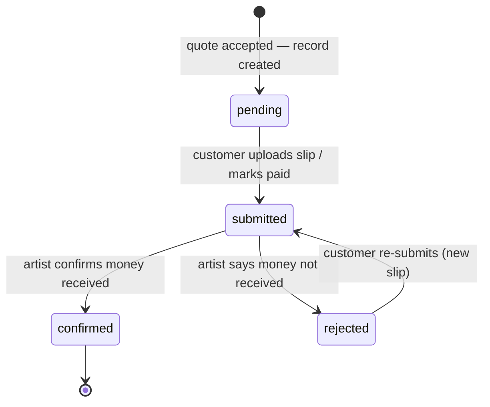

# 05 — Payments

## Model: direct transfer with proof (phase 1)

Money never touches the platform. The artist publishes how they want to be paid; the customer pays them directly; the platform's job is to make the *record* of that payment structured, timestamped, and attached to the commission.

**Why start here:**
- No payment-institution license, no gateway onboarding, no KYC program — legal to launch immediately in Thailand and internationally.
- Artists keep 100% (PromptPay transfers are free; PayPal takes its own cut, but that's between artist and PayPal).
- Matches how the Thai commission community already works (PromptPay slip culture), while adding the structure DMs lack.

**The trade-off, stated honestly in the UI/ToS:** the platform cannot hold funds, force refunds, or guarantee delivery. Trust comes from reviews, the immutable commission timeline, and admin sanctions — not escrow. Escrow is the phase-3 upgrade.

## Supported methods

| Method | Artist provides | Customer sees |
|--------|----------------|---------------|
| **PromptPay** | PromptPay ID (phone/citizen-ID/e-wallet) and/or uploaded QR image | QR to scan + ID to copy; amount shown alongside |
| **PayPal** | PayPal.me link | Link opens with amount pre-filled where possible (`paypal.me/name/25usd`) |
| **Bank transfer** | Bank, account number, account name | Copyable details |
| **Other** | Free-text instructions (e.g., Wise, GrabPay, Ko-fi) | Instructions as written |

Rules:
- At least one active method required before an artist can accept commissions.
- Methods are **not public** — visible only to a customer with an active commission at `accepted` or later (RLS-enforced, see [04-data-model.md](04-data-model.md)) to prevent scraping of PromptPay IDs and bank numbers.
- The exact details shown at pay time are snapshotted into the `payment_record`, so later edits to the artist's methods can't cause disputes about "which account was I told to pay".
- Generating the PromptPay QR server-side from the ID (EMVCo/PromptPay payload → QR, with amount embedded) is a **[v1]** nicety; MVP accepts an artist-uploaded QR image.

## Payment flow

1. Quote accepted → commission enters `awaiting_payment`; the platform creates the payment record(s) per the payment plan (`full` or `deposit` + `final`).
2. Customer opens the pay screen: amount + currency, the artist's methods, and an upload box for the slip/screenshot. Slips go to the private `payment-proofs` bucket.
3. Customer submits → artist notified. Artist checks their banking app / PayPal and taps **Confirm received** (or **Reject** with a reason).
4. On confirmation the commission moves to `paid` and both parties see the confirmation event on the timeline.
5. For split plans: deposit confirmation unlocks `in_progress`; the final record must be confirmed before final files are released (`delivered`).

Anti-forgery notes (slips can be faked):
- Confirmation authority is always the artist — the slip is *evidence*, not proof; only "artist confirms" moves the state.
- Store slip upload timestamp + uploader; show slip EXIF/creation warnings **[v2]** and integrate slip-verification APIs (Thai banks offer transfer-verification APIs via aggregators) **[v2]**.

## Disputes (direct-payment era)

- Either party flags the commission → status frozen (`disputed_at` set), admin case opened.
- Evidence = the timeline: quote terms, payment records with slips, WIPs, delivery events — all immutable and timestamped.
- Admin powers: mediate in a 3-way thread, annotate the outcome on both reviews, warn or suspend accounts, and (for repeat scammers) ban + surface the outcome on the profile.
- Admin **cannot** move money. The UI never implies buyer protection; the ToS states payments are between the two parties.
- Prevention beats mediation: statuses gate expectations (work shouldn't start before `paid`; full-res files shouldn't ship before final confirmation), and the new-account restrictions in [02-features.md](02-features.md) slow scam farms.

## Phase 3: gateway + escrow (design now, build later)

Target: **Opn Payments** (Thai gateway — PromptPay, Thai cards, TrueMoney) and/or **Stripe** (international cards; Stripe TH also supports PromptPay). Both offer marketplace-style flows suitable for escrow-like behavior.

What changes:
- New checkout option "Pay through Compamisson (protected)" alongside direct payment — artists opt in, platform fee (e.g., 5–8%) applies only to protected payments.
- `payment_records` already carries `provider` / `provider_ref` / `refunded`; a gateway payment is confirmed by **webhook**, not by the artist.
- Payout ledger + artist payout onboarding (KYC via the gateway's sub-merchant flow) — new tables (`payouts`, `balances`), no changes to existing ones.
- Refunds become enforceable for protected payments → dispute flow gains a real remedy.
- Regulatory: operating escrow in Thailand implicates payment-business licensing (Payment Systems Act); using the gateway's marketplace product (funds held by the licensed gateway, not by us) is the compliant path — confirm with counsel before build.

## Open questions to revisit

- Deposit default: should `split_50_50` be the recommended default for commissions above some amount (e.g., ฿2,000 / $60)?
- Auto-confirm: if an artist never confirms a submitted payment but starts posting WIPs, should the system infer confirmation? (Leaning no — keep the rule simple: artist must confirm.)
- PayPal G&S vs F&F guidance: the pay screen should explicitly tell customers to use Goods & Services for buyer protection, and warn artists about its fees.
